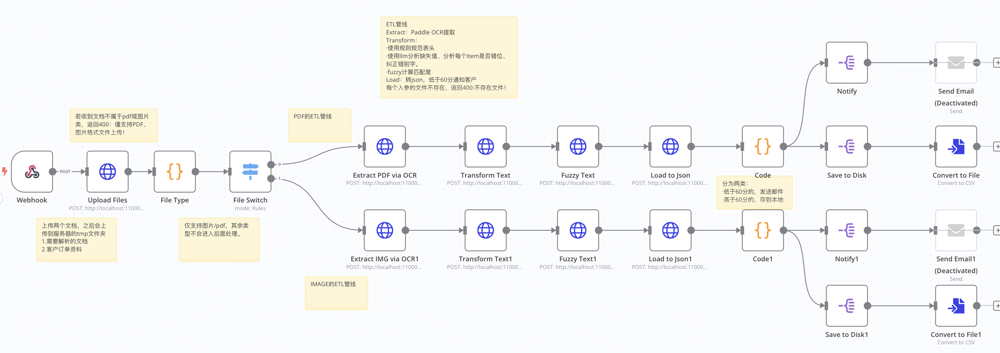

# Invoice Agent – 非结构化订单自动化处理系统

## 项目简介

**Invoice Agent** 是一套开源的自动化订单录入系统。它可以从客户上传的非结构化订单资料（如 PDF, 图片等）中，自动提取商品与数量，完成产品名称模糊比对、价格计算，最终输出标准 JSON 格式订单。

本项目基于 n8n 自动化平台构建，适合研发团队对接企业订单流，高度容错，支持多语言混合，按需支持人工校核。

---

## 系统架构与功能支持一览

### 🗺️ 工作流流程架构图

> *完整工作流和每节点功能，可在 docs/n8n_flow.png 查阅，n8n 配置在 n8n/invoice_agent.json（可导入自用）。*

---

### ✅ 功能一览表

| 功能模块                     | 实现情况 | 说明                                        |
|------------------------------|:-------:|-------------------------------------------|
| **1. 文件上传入口**           |   ✅    | 支持 API POST（多格式文件），可连接自定义表单               |
| **2. OCR 多语言识别**         |   ✅    | 内置开源 PaddleOCR，自动区分中英混合文本                 |
| **3. LLM结构化抽取**          |   ✅    | 可用 Ollama 处理OCR结果，抽取订单关键信息                |
| **4. 产品模糊比对**           |   ✅    | 采用rapidfuzz, 支持中英文/缩写/同音等不规范输入 |
| **5. 信心分/人工校核**        |   ✅    | 对低分比对项自动推送email人工复核后流转              |
| **6. 标准JSON订单输出**      |   ✅    | 输出结构化JSON，明示原始输入、匹配品名/ID、置信度等             |
| **7. 中英文产品混合支持**     |   ✅    | 产品库&比对引擎全面兼容                              |
| **8. 边界处理/异常分流**      |   ✅    | 支持空白提交/全未识别等，流程不中断，推送复核，状态明确              |
| **9. 工作流可视化与导入**    |   ✅    | n8n_flow.png配套详细节点说明，核心流程可一键导入n8n         |

---

### 🍀 流程节点简要说明

1. **Webhook接收**（文件或表单POST入口）：接收上传的PDF/JPG/PNG订单，支持API多端直连。
2. **FastAPI 上传落盘**：,webhook 接收文件后，调用 Python FastAPI 的 upload 接口，实现文件落盘保存，便于后续处理。
3. [OCR节点](docs/EXTRACT.md)：调用 PaddleOCR 识别引擎 ，智能判别中英文混合文本。
4. [LLM节点 & 产品模糊比对](docs/TRANSFORM.md)：配置Ollama API，将OCR文本精确结构化为[商品名、数量等],同时基于产品库进行模糊检索及置信度（信心分）判别，支持中英文等复杂场景。
5. [标准JSON汇总](docs/LOAD.md)：系统输出包含全流程详情的标准化订单JSON，并可写入后端/数据库/异步反馈。
6. **人工校核触发**：当某些订单项无法匹配或置信度过低时，在 n8n 对接收的 JSON 数据进行筛选，触发邮件 / IM 通知人工介入审核。
7. **异常/边界流程**：自动识别空订单、不明产品等异常，统一记录及状态流转，主流程不中断。

---

### 🌟 边界情况（Edge Case）处理说明

- **空白订单**：自动判别，不打断主流程。
- **完全无法比对到产品**：设置 status: "pending"，推送人工审核，无死循环。
- **中英夹杂、模糊描述订单**：识别及比对合并支持，人工参与阈值可调。

---

详细 n8n 工作流及所有脚本均在仓库内开放，欢迎直接导入体验、二次开发！
